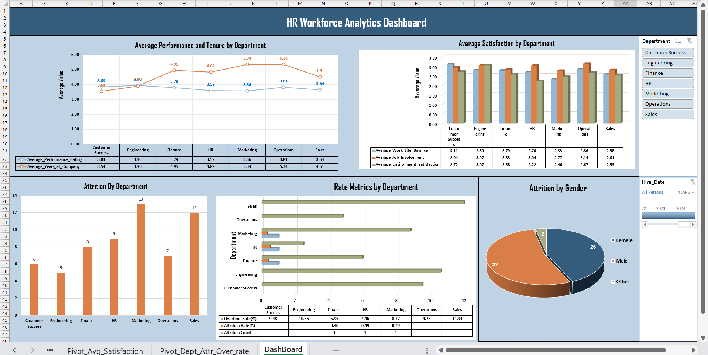

# 📊 HR Workforce Analytics Dashboard

## 🚀 Project Overview

This is my **first Excel dashboard project**, focused on analyzing workforce trends and employee attrition.
The goal of this project was to understand the fundamentals of data analysis, visualization, and dashboard building using Excel.

---

## 🛠️ Tools & Technologies Used

* Microsoft Excel
* Power Query (ETL Process)
* Power Pivot
* Pivot Tables
* Pivot Charts

---

## ⚙️ Project Workflow

### 🔹 Data Processing (ETL)

* Extracted and loaded data using **Power Query**
* Performed necessary **data cleaning and transformations**

### 🔹 Data Analysis

* Used **Pivot Tables** for analysis and summarization
* Created **calculated columns and measures** using Power Pivot

### 🔹 Data Visualization

* Built interactive visualizations using **Pivot Charts**
* Designed a structured dashboard layout

### 🔹 Interactivity

* Added **Slicers** for filtering (e.g., Department)
* Used **Timeline** for date-based filtering

---

## 📊 Dashboard Features

* Attrition analysis by **Department** and **Gender**
* Performance and tenure comparison across departments
* Workforce satisfaction metrics
* Department-wise rate metrics (Attrition, Overtime, etc.)

---

## 📸 Dashboard Preview

---

## 🎯 Key Learnings

* Understanding of **Excel-based dashboard creation**
* Hands-on experience with **Power Query and Power Pivot**
* Building **interactive and structured dashboards**
* Importance of **design, layout, and data storytelling**

---

## 📌 Note

This is a **beginner-level project** as it is my first dashboard.
More **advanced and feature-rich dashboards** (with KPIs and deeper insights) are coming soon 🚀

---
